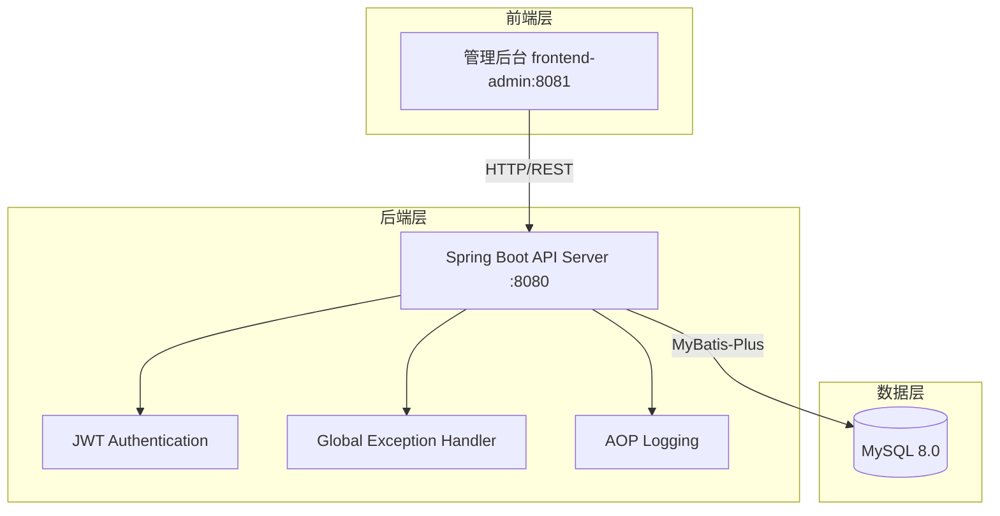
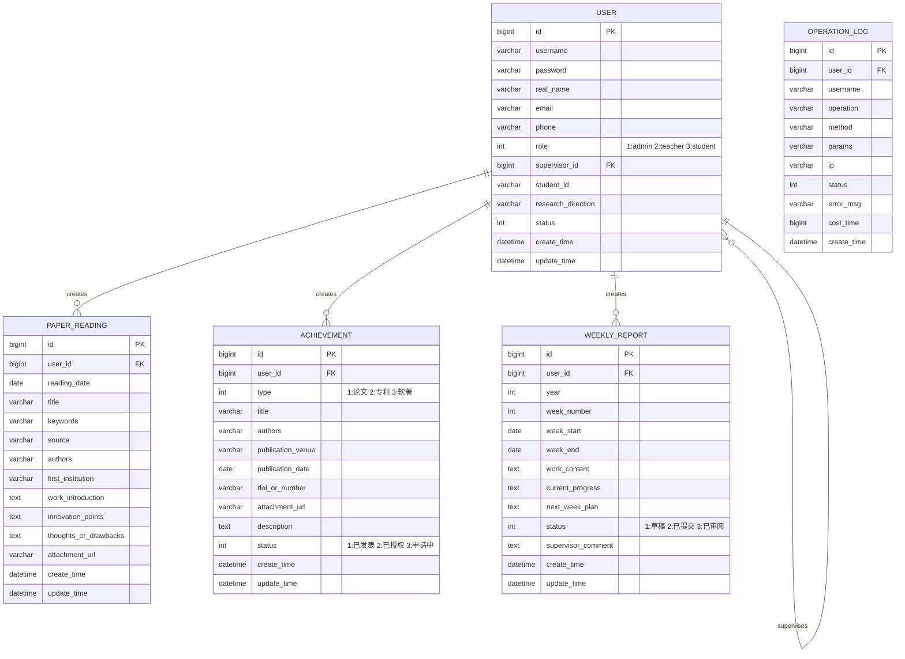

# 研究生培养科研管理系统 - 设计文档

## 1. 系统架构



## 2. ER 图



## 3. 接口清单

### 3.1 认证模块 (AuthController)
| Method | Path | Description |
|--------|------|-------------|
| POST | /api/auth/login | 用户登录 |
| POST | /api/auth/logout | 用户登出 |
| GET | /api/auth/info | 获取当前用户信息 |
| PUT | /api/auth/password | 修改密码 |

### 3.2 用户管理 (UserController)
| Method | Path | Description |
|--------|------|-------------|
| GET | /api/users | 分页查询用户列表 |
| GET | /api/users/{id} | 获取用户详情 |
| POST | /api/users | 新增用户 |
| PUT | /api/users/{id} | 更新用户 |
| DELETE | /api/users/{id} | 删除用户 |
| GET | /api/users/teachers | 获取导师列表 |
| GET | /api/users/students | 获取学生列表(导师视角) |

### 3.3 论文阅读 (PaperReadingController)
| Method | Path | Description |
|--------|------|-------------|
| GET | /api/paper-readings | 分页查询论文阅读记录 |
| GET | /api/paper-readings/{id} | 获取论文阅读详情 |
| POST | /api/paper-readings | 新增论文阅读记录 |
| PUT | /api/paper-readings/{id} | 更新论文阅读记录 |
| DELETE | /api/paper-readings/{id} | 删除论文阅读记录 |

### 3.4 成果登记 (AchievementController)
| Method | Path | Description |
|--------|------|-------------|
| GET | /api/achievements | 分页查询成果列表 |
| GET | /api/achievements/{id} | 获取成果详情 |
| POST | /api/achievements | 新增成果 |
| PUT | /api/achievements/{id} | 更新成果 |
| DELETE | /api/achievements/{id} | 删除成果 |
| GET | /api/achievements/statistics | 成果统计 |

### 3.5 周报管理 (WeeklyReportController)
| Method | Path | Description |
|--------|------|-------------|
| GET | /api/weekly-reports | 分页查询周报列表 |
| GET | /api/weekly-reports/{id} | 获取周报详情 |
| POST | /api/weekly-reports | 新增周报 |
| PUT | /api/weekly-reports/{id} | 更新周报 |
| DELETE | /api/weekly-reports/{id} | 删除周报 |
| PUT | /api/weekly-reports/{id}/submit | 提交周报 |
| PUT | /api/weekly-reports/{id}/review | 审阅周报(导师) |

### 3.6 文件上传 (FileController)
| Method | Path | Description |
|--------|------|-------------|
| POST | /api/files/upload | 上传文件 |
| GET | /api/files/{filename} | 下载文件 |

### 3.7 操作日志 (OperationLogController)
| Method | Path | Description |
|--------|------|-------------|
| GET | /api/operation-logs | 分页查询操作日志 |

## 4. UI/UX 规范

### 4.1 色彩系统
```scss
// 主色调
$primary-color: #409EFF;
$primary-light: #66B1FF;
$primary-dark: #337ECC;

// 功能色
$success-color: #67C23A;
$warning-color: #E6A23C;
$danger-color: #F56C6C;
$info-color: #909399;

// 中性色
$text-primary: #303133;
$text-regular: #606266;
$text-secondary: #909399;
$text-placeholder: #C0C4CC;

// 边框色
$border-base: #DCDFE6;
$border-light: #E4E7ED;
$border-lighter: #EBEEF5;

// 背景色
$bg-base: #F5F7FA;
$bg-light: #FAFAFA;
$bg-white: #FFFFFF;
```

### 4.2 字体规范
```scss
$font-family: 'Helvetica Neue', Helvetica, 'PingFang SC', 'Hiragino Sans GB', 'Microsoft YaHei', Arial, sans-serif;

$font-size-large: 18px;
$font-size-medium: 16px;
$font-size-base: 14px;
$font-size-small: 13px;
$font-size-mini: 12px;
```

### 4.3 间距规范
```scss
$spacing-mini: 4px;
$spacing-small: 8px;
$spacing-base: 16px;
$spacing-medium: 24px;
$spacing-large: 32px;
```

### 4.4 圆角规范
```scss
$border-radius-small: 4px;
$border-radius-base: 8px;
$border-radius-large: 12px;
$border-radius-round: 20px;
```

### 4.5 阴影规范
```scss
$box-shadow-base: 0 2px 12px 0 rgba(0, 0, 0, 0.1);
$box-shadow-light: 0 2px 4px 0 rgba(0, 0, 0, 0.05);
$box-shadow-dark: 0 4px 16px 0 rgba(0, 0, 0, 0.15);
```

## 5. 技术栈

### 5.1 后端
- Java 17
- Spring Boot 3.2.x
- MyBatis-Plus 3.5.x
- MySQL 8.0
- JWT (jjwt 0.12.x)
- Lombok
- Validation

### 5.2 前端
- Vue 3.4.x
- Vite 5.x
- Element Plus 2.5.x
- Pinia 2.x
- Vue Router 4.x
- Axios
- SCSS
